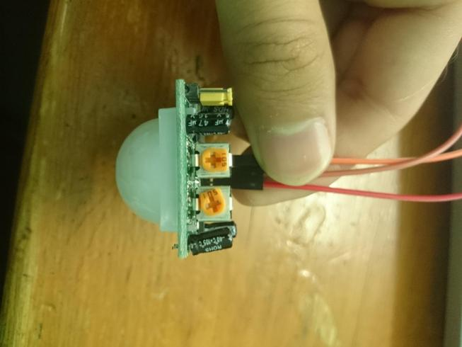

# arduino-pir
Tips setup PIR sensor for arduino
1. Rotate right trimpot counter clockwise max
2. Rotate left trimpot to the middle
3. If there is a jumper you can switch to middle-up position

    
    
4. For first time circuit PIR needed a lil bit seconds to minutes for warming up placing sensor to blank space and no movement object
5. After detecting movement give delay (mine 5 secs) for next reading sensor 

Image from https://electronics.stackexchange.com/questions/220641/pir-sensor-always-gives-high
